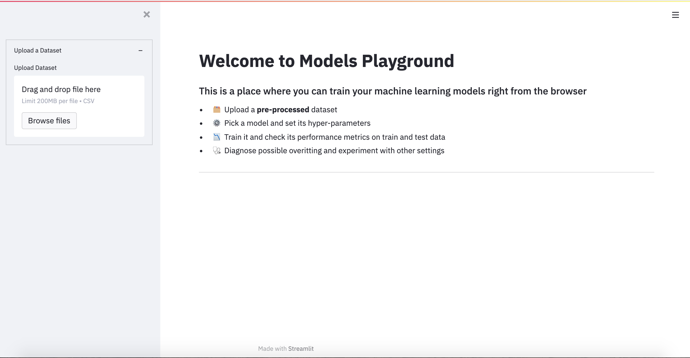
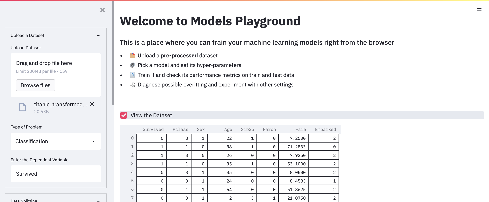
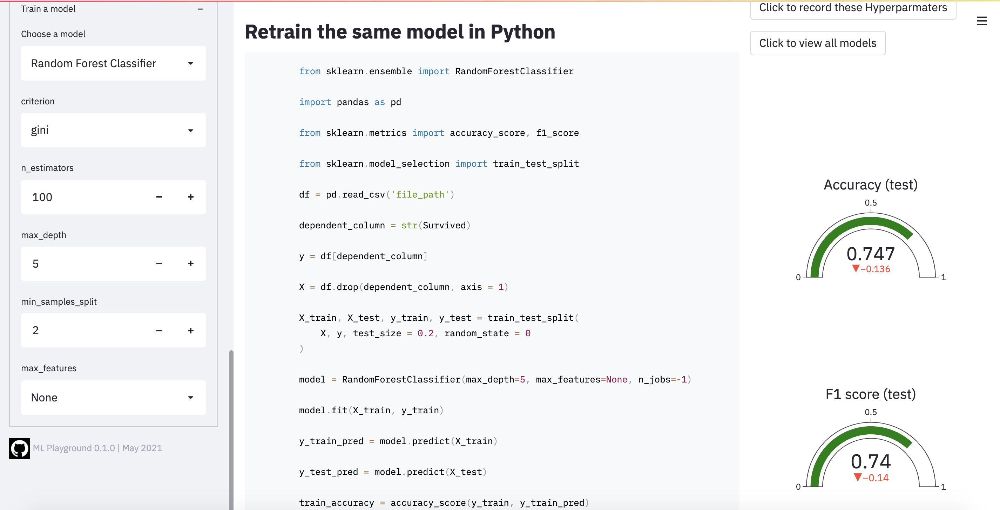
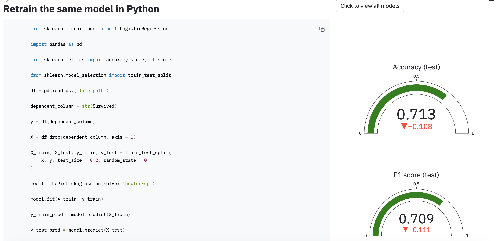
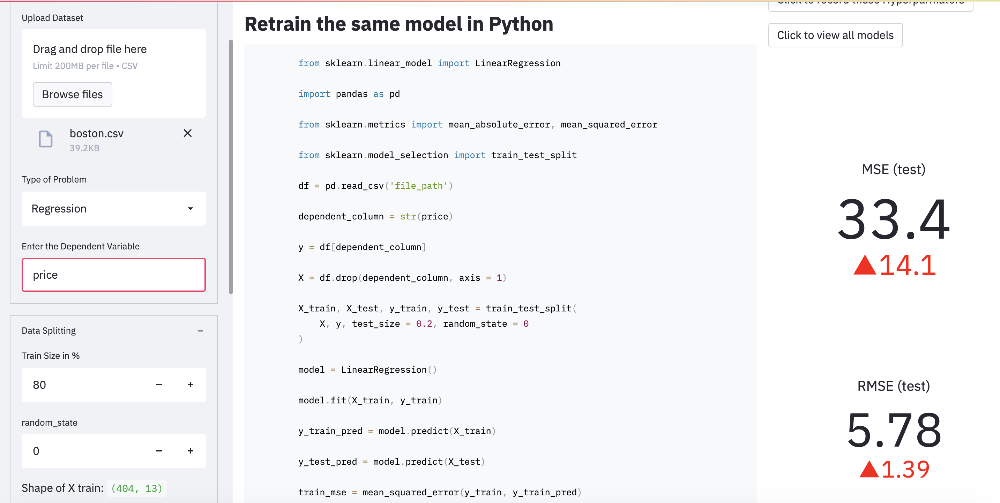

<p align="center">
    
    <h2 align="center">Models Playground</h2>
    <h5 align = "center"> 

     🗂️ Upload a Preprocessed Dataset

     🌠 Choose whether to perform Classification or Regression

     🦹 Enter the Dependent Variable

     🪓 Type in the split ratio

     ⚖️ Select the Scaling method
      
     ⚙️ Pick a Model and set its Hyper-Parameters
  
     📉 Train it and check its Performance Metrics on Train and Test data
  
     🩺 Diagnose possible overitting and experiment with other settings

     📠 Copy the code snippet to run in jupyter or colab

     🚀 If you find the model to be performing well, save the model's hyperparameters with a single click

     🎑 View all the saved models.

</p>

### What is the idea?
  - Ever felt tired after preprocessing the dataset, and not wanting to write any code further to train your model? Ever encountered a situation where you wanted to record the hyperparameters of the trained model and able to retrieve it afterward
  -  Models Playground is here to help you do that. Models playground allows you to train your models right from the browser.
  -  Just upload the preprocessed dataset, choose the option to perform classification or regression. Enter the dependent variable, type in the split ratio and choose a scaling method(MinMaxScaler or StandardScaler), and enter the columns to be scaled.
  - Select a model and adjust its hyperparameters to get the best result.
  - Copy the automatically generated code snippet to train in Jupyter or Colab.
  - If you find the model to be performing well click the save hyperparameters button to save the results to a data.txt file.
  - To view all the hyperparameters saved till now, display them on the screen with a single click.

### Built Using:
<br>
<br>
<br>

### Instructions to run:
* Pre-requisites:
	-  Python 3.6 or 3.7 or 3.8
	-  Dependencies from requirements.txt
    
* Directions to Install

   - First clone this repository onto your system.<br>
   - Then, create a Virtual Environment and install the packages from requirements.txt: <br>
   - Navigate to this repository, create a Virtual Environment and activate it: <br>
   ```bash
  cd path/to/cloned/repo

  ##(for Mac and Linux)
  python3 -m venv env 
  source env/bin/activate
  ##(for Windows)
  python3 -m venv env
  .\env\Scripts\activate
  ```
  Install the python dependencies from requirements.txt:
    ```bash
    pip install -r requirements.txt
     ```
* Directions to Execute

    Run the following command in the terminal -
    ```bash
    streamlit run app.py
    ```
### Different Screens
<br>
<br>
<br>
<br>
<br>
<br>


